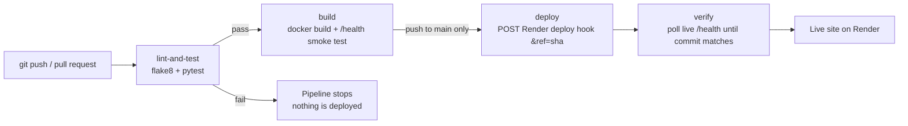

# Student Attendance System

A small dynamic web app for tracking lecture attendance. The app builds its pages on the server from in-memory data. It tests, lints and packages itself in Docker, and a GitHub Actions CI/CD pipeline deploys it to Render.

Built for **CCA 2 – Cloud Computing and DevOps (CSE30040)**, MIT World Peace University, Pune.

- **Live application:** https://ccd-cc2.onrender.com
- **GitHub repository:** https://github.com/adityabhingare1111-cell/ccd-cc2
- **Pipeline runs:** https://github.com/adityabhingare1111-cell/ccd-cc2/actions

## Features

- **Attendance table** on the home page: roll number, name, classes attended, total classes and attendance percentage. Students below 75% are highlighted in red.
- **Add Student** form: roll number and name. Empty fields and duplicate roll numbers are rejected with HTTP 400.
- **Mark Attendance** form: pick a date and tick the students who were present. Future dates and dates already marked are rejected with HTTP 400.
- **Defaulters filter**: `/?filter=defaulters` shows only students below 75%.
- **JSON API**: `GET /api/students` and `GET /api/attendance?date=YYYY-MM-DD`.
- **Health check**: `GET /health` returns `{"status": "ok", "commit": "<7-char sha>"}`.
- **Commit ID in the footer**, read from `RENDER_GIT_COMMIT` (falling back to `GIT_SHA`, then `local`).
- Five sample students and four sample lecture days are loaded at startup. Data resets when the app restarts.

## Tech stack

| Part | Tool |
|------|------|
| Language / framework | Python 3.12, Flask |
| Pages | Jinja2 templates (`base.html` layout), plain HTML + CSS |
| Storage | In-memory Python dicts |
| Tests / lint | pytest, flake8 (max line length 120) |
| Production server | gunicorn |
| Container | Docker (`python:3.12-slim`, non-root user) |
| CI/CD | GitHub Actions |
| Hosting | Render (free tier, Docker runtime, deploy hook) |

## Project structure

```
student-attendance-system/
├── .github/workflows/ci-cd.yml   # CI/CD pipeline
├── templates/
│   ├── base.html                 # shared layout (header, footer)
│   └── index.html                # home page: table + forms
├── static/style.css              # styles
├── app.py                        # Flask app
├── test_app.py                   # pytest tests
├── requirements.txt              # runtime deps (flask, gunicorn)
├── requirements-dev.txt          # + pytest, flake8
├── Dockerfile
├── .dockerignore
├── .flake8                       # flake8 settings
└── .gitignore
```

## Run locally

**Windows (PowerShell)**

```powershell
python -m venv venv
venv\Scripts\activate
pip install -r requirements-dev.txt
python app.py
```

**macOS / Linux**

```bash
python3 -m venv venv
source venv/bin/activate
pip install -r requirements-dev.txt
python app.py
```

Open http://localhost:5000. To use a different port, set `PORT` first: `$env:PORT=8000` (PowerShell) or `export PORT=8000` (bash).

## Run tests and lint

```bash
flake8 .
pytest -v
```

## Run with Docker

```bash
docker build --build-arg GIT_SHA=$(git rev-parse HEAD) -t attendance-app .
docker run --rm -p 5000:5000 attendance-app
```

Then open http://localhost:5000/health. On Windows PowerShell, `$(git rev-parse HEAD)` works as is.

## API examples

```bash
curl http://localhost:5000/api/students
curl "http://localhost:5000/api/attendance?date=2025-07-04"
curl http://localhost:5000/health
```

## CI/CD pipeline



| Job | What it does | Runs on |
|-----|--------------|---------|
| `lint-and-test` | Installs dev deps, runs `flake8` and `pytest -v` | Every push and every PR to `main` |
| `build` | Builds the Docker image with `GIT_SHA`, starts it, `curl -f /health` | After `lint-and-test` passes |
| `deploy` | Calls the Render deploy hook (GitHub Secret `RENDER_DEPLOY_HOOK`) for this exact commit | After `build`, on push to `main` only |
| `verify` | Polls `LIVE_URL/health` for up to ~5 minutes until `commit` matches this run's SHA | After `deploy` |

Secrets and URLs are never written into the code or the YAML. The deploy hook is a GitHub **Secret** and the live URL is a GitHub **Variable**.
